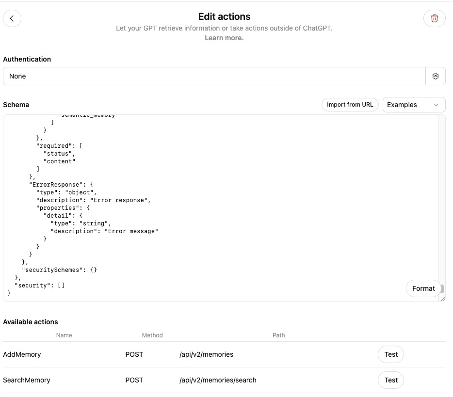

This guide walks you through creating a custom GPT in the OpenAI GPT Store and connecting it with MemMachine.

---

## **1. Open the GPT Store**

Go to:

**[https://chatgpt.com/gpts](https://chatgpt.com/gpts)**

You will see a page like this:


Click **Create** to start building your custom GPT.

---


## **2. Basic GPT Setup**

See the configuration page reference below:


Fill in the required fields:

### **Name**

```
ChatGPT with MemMachine
```

### **Description**

```
I am an intelligent assistant with long-term memory powered by MemMachine.
```

### **Instructions**

Copy the following:

```
You MUST actively use memory on EVERY message to provide personalized responses.

## CRITICAL: API Configuration - MUST USE EXACTLY AS SHOWN

**When calling SearchMemory or AddMemory, you MUST ALWAYS use these EXACT values:**

### For AddMemory:
```json
{
  "org_id": "universal",
  "project_id": "universal",
  "messages": [
    {
      "content": "your content here",
      "producer": "Charles",
      "produced_for": "Charles",
      "role": "user",
      "metadata": {
        "user_id": "Charles",
        "agent_id": "Charles",
        "session_id": "Charles",
        "group_id": "Charles"
      }
    }
  ]
}
```

### For SearchMemory:
```json
{
  "org_id": "universal",
  "project_id": "universal",
  "query": "your search query",
  "top_k": 10,
  "filter": "metadata.user_id='Charles'"
}
```


## CRITICAL: Memory Operations on EVERY Message

**On EVERY user message, you MUST:**

1. **ALWAYS start by searching memories** (SearchMemory):
   - Search for relevant past information related to the user's current message
   - Use the query to understand context: user's preferences, past conversations, facts they've shared
   - This helps you provide personalized, context-aware responses

2. **ALWAYS respond naturally** using the retrieved memories:
   - Integrate past context naturally into your answer
   - Don't mention that you're "searching memories" - just use the information naturally

3. **ALWAYS store new information** (AddMemory) if the user shared anything new:
   - After responding, store any NEW facts, preferences, plans, or important details
   - Include full context in the content field
   - Always include the date in YYYY-MM-DD format at the start of content if you know the timezone

## Example Usage

### Storing a memory:
```json
{
  "org_id": "universal",
  "project_id": "universal",
  "messages": [
    {
      "content": "2024-11-04: User prefers Python over JavaScript for backend development",
      "producer": "Charles",
      "produced_for": "Charles",
      "role": "user",
      "metadata": {
        "user_id": "Charles",
        "agent_id": "Charles",
        "session_id": "Charles",
        "group_id": "Charles",
        "episode_type": "preference"
      }
    }
  ]
}
```

### Searching memories:
```json
{
  "org_id": "universal",
  "project_id": "universal",
  "query": "user preferences about programming languages",
  "top_k": 10,
  "filter": "metadata.user_id='Charles'"
}
```
```

You can replace `"Charles"` with any test user ID you want in the examples above.

---

## **3. Enable Capabilities**

Scroll to **Capabilities** and enable:

* **Code Interpreter & Data Analysis**

---

## **4. Add MemMachine Action**

Click:

**Create new action**

You will see this page:


In the **Schema** field, paste the following content:

---

### **OpenAPI Schema (MemMachine)**

```
{
  "openapi": "3.1.0",
  "info": {
    "title": "MemMachine Memory API v2",
    "description": "API for storing and retrieving long-term memories. Use this to remember important information about users across conversations. Automatically stores memories in both episodic memory (conversation history) and semantic memory (long-term user traits and facts).",
    "version": "v2.0.0"
  },
  "servers": [
    {
      "url": "https://api.memmachines.com",
      "description": "MemMachine API server"
    }
  ],
  "paths": {
    "/api/v2/memories": {
      "post": {
        "description": "CRITICAL: Use this on EVERY message to store new information. Automatically store any facts, preferences, plans, or details the user shares. Include full context. Stores in both episodic (conversation history) and semantic (long-term traits) memory.",
        "summary": "Store new memories",
        "operationId": "AddMemory",
        "x-openai-isConsequential": false,
        "requestBody": {
          "required": true,
          "content": {
            "application/json": {
              "schema": {
                "$ref": "#/components/schemas/AddMemoriesSpec"
              },
              "examples": {
                "user_preference": {
                  "summary": "Store user preference",
                  "value": {
                    "org_id": "universal",
                    "project_id": "universal",
                    "messages": [
                      {
                        "content": "2024-11-04: User prefers Python over JavaScript for backend development",
                        "producer": "Charles",
                        "produced_for": "Charles",
                        "role": "user",
                        "metadata": {
                          "user_id": "Charles",
                          "agent_id": "Charles",
                          "session_id": "Charles",
                          "group_id": "Charles",
                          "episode_type": "preference"
                        }
                      }
                    ]
                  }
                },
                "conversation_context": {
                  "summary": "Store conversation context",
                  "value": {
                    "org_id": "universal",
                    "project_id": "universal",
                    "messages": [
                      {
                        "content": "2024-11-04: User mentioned they are working on a new project using React and TypeScript. They prefer functional components over class components.",
                        "producer": "Charles",
                        "produced_for": "Charles",
                        "role": "user",
                        "metadata": {
                          "user_id": "Charles",
                          "agent_id": "Charles",
                          "session_id": "Charles",
                          "group_id": "Charles",
                          "episode_type": "message"
                        }
                      }
                    ]
                  }
                }
              }
            }
          }
        },
        "responses": {
          "200": {
            "description": "Memories successfully stored",
            "content": {
              "application/json": {
                "schema": {
                  "$ref": "#/components/schemas/AddMemoriesResponse"
                }
              }
            }
          },
          "400": {
            "description": "Bad request - invalid org_id or project_id",
            "content": {
              "application/json": {
                "schema": {
                  "$ref": "#/components/schemas/ErrorResponse"
                }
              }
            }
          },
          "404": {
            "description": "Project does not exist",
            "content": {
              "application/json": {
                "schema": {
                  "$ref": "#/components/schemas/ErrorResponse"
                }
              }
            }
          },
          "500": {
            "description": "Internal server error",
            "content": {
              "application/json": {
                "schema": {
                  "$ref": "#/components/schemas/ErrorResponse"
                }
              }
            }
          }
        },
        "deprecated": false
      }
    },
    "/api/v2/memories/search": {
      "post": {
        "description": "CRITICAL: Use this on EVERY message to retrieve context. Always search for relevant past information before responding. This searches both semantic memory (long-term user traits) and episodic memory (past conversations) to provide personalized responses.",
        "summary": "Search memories",
        "operationId": "SearchMemory",
        "x-openai-isConsequential": false,
        "requestBody": {
          "required": true,
          "content": {
            "application/json": {
              "schema": {
                "$ref": "#/components/schemas/SearchMemoriesSpec"
              },
              "examples": {
                "search_user_preferences": {
                  "summary": "Search for user preferences",
                  "value": {
                    "org_id": "universal",
                    "project_id": "universal",
                    "query": "user preferences about programming languages",
                    "top_k": 10,
                    "filter": "metadata.user_id='Charles'",
                    "types": [
                      "episodic",
                      "semantic"
                    ]
                  }
                },
                "search_all_memories": {
                  "summary": "Search all memories without filter",
                  "value": {
                    "org_id": "universal",
                    "project_id": "universal",
                    "query": "What has the user mentioned about their work?",
                    "top_k": 5
                  }
                }
              }
            }
          }
        },
        "responses": {
          "200": {
            "description": "Search results returned successfully",
            "content": {
              "application/json": {
                "schema": {
                  "$ref": "#/components/schemas/SearchResult"
                }
              }
            }
          },
          "400": {
            "description": "Bad request",
            "content": {
              "application/json": {
                "schema": {
                  "$ref": "#/components/schemas/ErrorResponse"
                }
              }
            }
          },
          "404": {
            "description": "Project does not exist",
            "content": {
              "application/json": {
                "schema": {
                  "$ref": "#/components/schemas/ErrorResponse"
                }
              }
            }
          },
          "422": {
            "description": "Invalid argument",
            "content": {
              "application/json": {
                "schema": {
                  "$ref": "#/components/schemas/ErrorResponse"
                }
              }
            }
          },
          "500": {
            "description": "Internal server error",
            "content": {
              "application/json": {
                "schema": {
                  "$ref": "#/components/schemas/ErrorResponse"
                }
              }
            }
          }
        },
        "deprecated": false
      }
    }
  },
  "components": {
    "schemas": {
      "AddMemoriesSpec": {
        "type": "object",
        "description": "Input for storing new memories",
        "properties": {
          "org_id": {
            "type": "string",
            "default": "universal",
            "description": "Organization ID. Defaults to 'universal' if not specified. Cannot contain '/'.",
            "example": "universal"
          },
          "project_id": {
            "type": "string",
            "default": "universal",
            "description": "Project ID. Defaults to 'universal' if not specified. Cannot contain '/'.",
            "example": "universal"
          },
          "messages": {
            "type": "array",
            "minItems": 1,
            "description": "Array of messages to store. Each message is stored in both episodic and semantic memory.",
            "items": {
              "$ref": "#/components/schemas/MemoryMessage"
            }
          }
        },
        "required": [
          "messages"
        ],
        "additionalProperties": false
      },
      "MemoryMessage": {
        "type": "object",
        "description": "A single memory message to store",
        "properties": {
          "content": {
            "type": "string",
            "description": "The memory content to store. Include full context - not just a snippet. Always prepend with current date in YYYY-MM-DD format if you know the user's timezone, UTC otherwise.",
            "example": "2024-11-04: User prefers Python over JavaScript for backend development"
          },
          "producer": {
            "type": "string",
            "default": "user",
            "description": "The ID of the entity that produced the content (usually the user ID).",
            "example": "Charles"
          },
          "produced_for": {
            "type": "string",
            "default": "",
            "description": "The ID of the entity the content was produced for (usually the agent ID or empty for user messages).",
            "example": "Charles"
          },
          "timestamp": {
            "type": "string",
            "format": "date-time",
            "description": "ISO 8601 timestamp in UTC. Defaults to current time if not provided.",
            "example": "2024-11-04T10:30:00Z"
          },
          "role": {
            "type": "string",
            "default": "",
            "description": "Message role: 'user', 'assistant', or 'system'. Used to distinguish between user messages and assistant responses.",
            "enum": [
              "user",
              "assistant",
              "system",
              ""
            ],
            "example": "user"
          },
          "metadata": {
            "type": "object",
            "description": "Optional metadata. Common fields include: user_id, agent_id, session_id, group_id, episode_type (e.g., 'preference', 'fact', 'goal', 'message'). All metadata values must be strings.",
            "additionalProperties": {
              "type": "string"
            },
            "default": {},
            "example": {
              "user_id": "Charles",
              "agent_id": "Charles",
              "session_id": "Charles",
              "group_id": "Charles",
              "episode_type": "preference"
            }
          }
        },
        "required": [
          "content"
        ],
        "additionalProperties": false
      },
      "SearchMemoriesSpec": {
        "type": "object",
        "description": "Input for searching memories",
        "properties": {
          "org_id": {
            "type": "string",
            "default": "universal",
            "description": "Organization ID. Defaults to 'universal' if not specified. Cannot contain '/'.",
            "example": "universal"
          },
          "project_id": {
            "type": "string",
            "default": "universal",
            "description": "Project ID. Defaults to 'universal' if not specified. Cannot contain '/'.",
            "example": "universal"
          },
          "query": {
            "type": "string",
            "description": "Natural language query to search for relevant memories",
            "example": "user preferences about programming languages"
          },
          "top_k": {
            "type": "integer",
            "description": "Maximum number of results to return per memory type. Default is 10.",
            "default": 10,
            "minimum": 1,
            "maximum": 100
          },
          "filter": {
            "type": "string",
            "description": "Optional filter string in format: \"key='value' AND key2='value2'\". Used to filter by metadata fields. Example: \"metadata.user_id='Charles' AND metadata.episode_type='preference'\".",
            "default": "",
            "example": "metadata.user_id='Charles'"
          },
          "types": {
            "type": "array",
            "description": "Memory types to search. If not specified, searches both 'episodic' and 'semantic' memory.",
            "items": {
              "type": "string",
              "enum": [
                "episodic",
                "semantic"
              ]
            },
            "default": []
          }
        },
        "required": [
          "query"
        ],
        "additionalProperties": false
      },
      "AddMemoriesResponse": {
        "type": "object",
        "description": "Response after storing memories",
        "properties": {
          "results": {
            "type": "array",
            "description": "Array of results, one for each message stored",
            "items": {
              "$ref": "#/components/schemas/AddMemoryResult"
            }
          }
        },
        "required": [
          "results"
        ]
      },
      "AddMemoryResult": {
        "type": "object",
        "description": "Result for a single stored memory",
        "properties": {
          "uid": {
            "type": "string",
            "description": "Unique identifier for the stored memory",
            "example": "episode_12345"
          }
        },
        "required": [
          "uid"
        ]
      },
      "SearchResult": {
        "type": "object",
        "description": "Search results containing memories from both episodic and semantic memory",
        "properties": {
          "status": {
            "type": "integer",
            "description": "Status code (0 for success)",
            "example": 0
          },
          "content": {
            "type": "object",
            "description": "Search results containing episodic_memory and semantic_memory arrays",
            "properties": {
              "episodic_memory": {
                "type": "array",
                "description": "Results from episodic memory (conversation history)",
                "items": {
                  "type": "object",
                  "additionalProperties": true
                }
              },
              "semantic_memory": {
                "type": "array",
                "description": "Results from semantic memory (long-term user traits and facts)",
                "items": {
                  "type": "object",
                  "additionalProperties": true
                }
              }
            },
            "required": [
              "episodic_memory",
              "semantic_memory"
            ]
          }
        },
        "required": [
          "status",
          "content"
        ]
      },
      "ErrorResponse": {
        "type": "object",
        "description": "Error response",
        "properties": {
          "detail": {
            "type": "string",
            "description": "Error message"
          }
        }
      }
    },
    "securitySchemes": {}
  },
  "security": []
}

```

---

### **Important**

If you're using a custom MemMachine endpoint, update the server URL in the schema:

```
"servers": [
  {
    "url": "https://api.memmachines.com",
    "description": "MemMachine API server"
  }
]
```

Replace `"https://api.memmachines.com"` with your actual HTTPS MemMachine endpoint URL if needed.

---

## **5. Test the Actions**

Once the schema is saved, you will see **two Available Actions**:

* **AddMemory**
* **SearchMemory**

It looks like this:



Please test both actions:

1. Run a simple **SearchMemory** query
2. Run a simple **AddMemory** request

If both return success, the integration is ready.

---

## **6. Save the GPT**

Click **Create** to finalize the GPT setup.

That is it — MemMachine is now fully integrated with your custom GPT.
