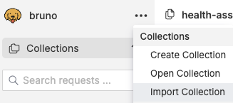

# Query heatlh assitant

Download [Bruno](https://www.usebruno.com/).

Click `import collection` in the burger menu at the top.



Start the health assitant:

```bash
$ HEALTH_PORT=8001 python3 health_server.py                       
INFO:     Started server process [40541]
INFO:     Waiting for application startup.
INFO:     Application startup complete.
INFO:     Uvicorn running on http://0.0.0.0:8001 (Press CTRL+C to quit)
```

Use the requests within Bruno.