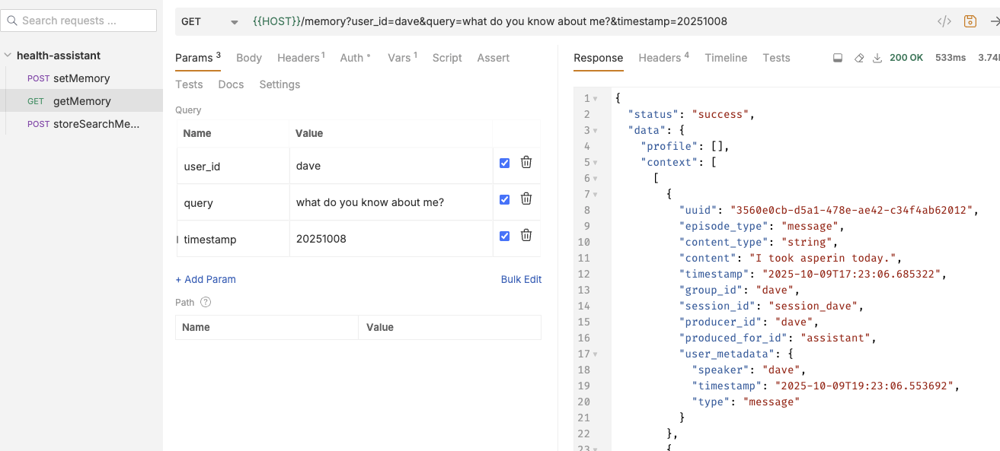

# Heatlh Assitant

## Start MemMachine

Use the README at the top of the repository to start MemMachine.

## Start Assistant

Start the health assitant:

```bash
$ HEALTH_PORT=8001 python3 health_server.py                       
INFO:     Started server process [40541]
INFO:     Waiting for application startup.
INFO:     Application startup complete.
INFO:     Uvicorn running on http://0.0.0.0:8001 (Press CTRL+C to quit)
```

## Bruno

Download [Bruno](https://www.usebruno.com/).

Click `import collection` in the burger menu at the top.


You'll find a `bruno.json` file within this directory.

### Set Memories

We'll use the POST endpoint to store memories.


### Query the memories

And the GET endpoint to get them. We'll also get a filled out context prompt.


